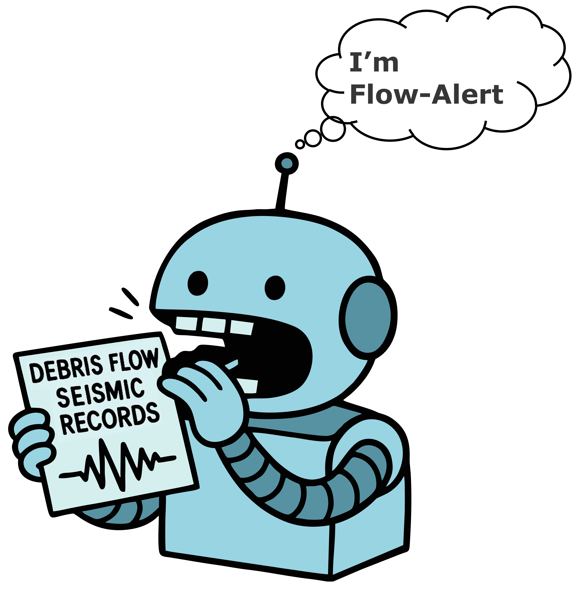

## 📢 Welcome to **Flow-Alert**

---

If you're interested in leveraging **machine learning** and **seismic signals** for **channelized flow early warning**, <br>
including, but not limited to, **debris flows**, **glacial lake outburst floods (GLOFs)**, and **lahars**, <br>
you've come to the right place! <br>
Check out our repository to get started.

### 🛠️ 0. Major Changes for v1.2
**1,** Added v2 model based on Type E features (13 selected features) with LSTM + Attention; <br>
it may not outperform the Feature C model (2020 Illgraben data) but shows more robust transferability. <br>
**2,** Added test catchments from 2023–2024 Wandong (in-house data):
[2023 results](demo/Wandong/pro_Luding-WD-2023-STA02-BHZ-E-testing-False.png), [2024 results](demo/Wandong/pro_Luding-AM-2024-R9BF5-EHZ-E-testing-False.png) <br>
**3,** Added real-time testing for Yanmen catchment (ongoing): [Yanmen](demo/Yanmen)


### 📁 1. Repository Structure
```bash
Flow-Alert
├── calculate_features   # Convert raw seismic data into features
├── config               # Configuration files
├── data                 # Seismic data and extracted features
├── demo                 # Examples of running the case
├── docs                 # Documentation for users
├── functions            # Core functions and scripts
├── trained_model        # Pre-trained models
    └── feature_imp      # Seismic geature weight
    └── v1model         # Model version 1
    └── v2model         # Model version 2, with less input features
```

### 🚀 2. How to Use Our Pre-trained Models on Your Data? <br>
To get started: <br>
2.1, Check the [To-Do-List](docs/To-Do-List.md) for setup and prerequisites <br>
2.2, Follow our tutorial notebook: [Inference Tutorial](demo/inference_tutorial.ipynb) <br>


### 🐛 3. Found a Bug? <br>
Feel free to open a **Pull request**, or reach out to us via email.


### ❓️4. Have Questions? <br>
4.1 Start by reading our related paper <br>
**Qi Zhou**, Hui Tang, Clément Hibert, Małgorzata Chmiel, Fabian Walter, Michael Dietze, and Jens M Turowski. <br>
"Enhancing debris flow warning via machine learning feature reduction and model selection." <br>
**_Journal of Geophysical Research: Earth Surface_**, 129, e2024JF008094. <br>
[Click here for the manuscript](https://doi.org/10.1029/2024JF008094) <br>

If you still have questions, feel free to contact the project contributors.

4.2 Or reach out to our research groups <br>
[Hazards and Surface Processes Research Group and Digital Earth Lab](https://www.gfz.de/en/section/earth-surface-process-modelling/topics/hazards-and-surface-processes) <br> 
Led by Dr. Hui [Tang](https://www.gfz.de/en/staff/hui.tang/sec47) <br>
[Physical Earth Surface Modelling Lab](https://www.gfz.de/en/staff/jens.turowski/sec46) <br>
Led by Dr. Jens [Turowski](https://www.gfz.de/en/staff/jens.turowski/sec46).


### 💪 5. Contributors <br>
**[Qi Zhou](https://github.com/Qi-Zhou-Geo)** <br>
qi.zhou@gfz.de or qi.zhou.geo@gmail.com <br>

**[Kshitij Kar](https://github.com/Kshitij301199)** <br>
kshitij.kar@gfz-potsdam.de <br>
