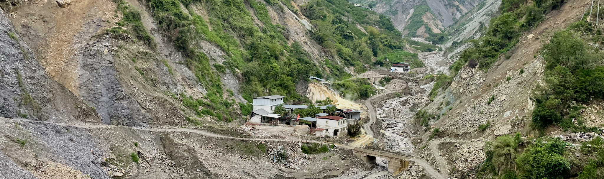

## 📢 Welcome to **Flow-Alert**

If you're interested in leveraging 💻 **machine learning** and 〰️ **seismic signals** for **channelized flow early warning**, <br>
including, but not limited to, **debris flows**, **glacial lake outburst floods (GLOFs)**, and **lahars**, <br>
you've come to the right place! <br>
Check out our repository to get started.
---

### 📁 1. Repository Structure
```bash
Flow-Alert
├── calculate_features   # Convert raw seismic data into features
├── config               # Configuration files
├── data                 # Seismic data and extracted features
├── docs                 # Documentation for users
├── functions            # Core functions and scripts
└── trained_model        # Pre-trained v1-model
```

### 🚀 2. How to Use Our Pre-trained Models on Your Data? <br>
To get started: <br>
2.1, Check the [To-Do-List](docs/To-Do-List.md) for setup and prerequisites <br>
2.2, Follow our tutorial notebook: [Inference Tutorial](docs/inference_tutorial.ipynb) <br>


### 🐛 3. Found a Bug? <br>
Feel free to open a **Pull request**, or reach out to us via email.


### ❓️4. Have Questions? <br>
4.1 Start by reading our related paper <br>
**Qi Zhou**, Hui Tang, Clément Hibert, Małgorzata Chmiel, Fabian Walter, Michael Dietze, and Jens M Turowski. <br>
"Enhancing debris flow warning via machine learning feature reduction and model selection." <br>
**_Journal of Geophysical Research: Earth Surface_**, 129, e2024JF008094. <br>
[Click here for the manuscript](https://doi.org/10.1029/2024JF008094) <br>

If you still have questions, feel free to contact: **Qi Zhou** <br>
qi.zhou@gfz.de <br>
qi.zhou.geo@gmail.com <br>

4.2 Or reach out to our research groups <br>
[Hazards and Surface Processes Research Group and Digital Earth Lab](https://www.gfz.de/en/section/earth-surface-process-modelling/topics/hazards-and-surface-processes) <br> 
Led by Dr. Hui [Tang](https://www.gfz.de/en/staff/hui.tang/sec47) <br>
[Physical Earth Surface Modelling Lab](https://www.gfz.de/en/staff/jens.turowski/sec46) <br>
Led by Dr. Jens [Turowski](https://www.gfz.de/en/staff/jens.turowski/sec46).
