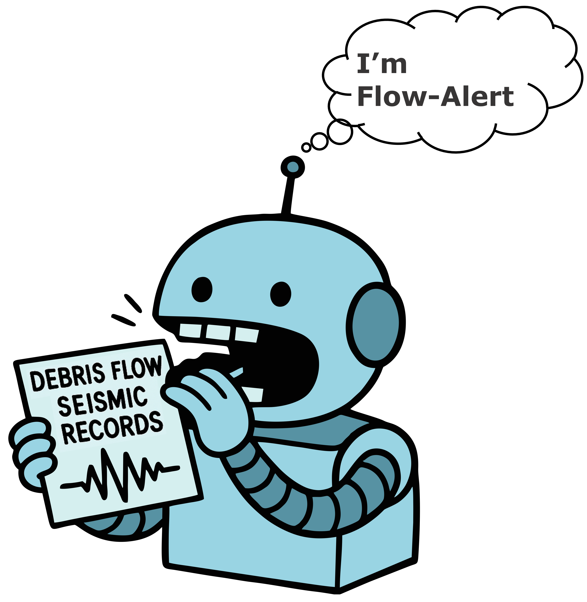

## 📢 Welcome to **Flow-Alert**

---

If you're interested in leveraging **machine learning** and **seismic signals** for **channelized flow early warning**, <br>
including, but not limited to, **debris flows**, **glacial lake outburst floods (GLOFs)**, and **lahars**, <br>
you've come to the right place! <br>
Check out our repository to get started.

### 🛠️ 0. Major Changes for v1.4
Previous releases:
- [Version 1.0](https://doi.org/10.5281/zenodo.15020368)
- [Version 1.1](https://doi.org/10.5281/zenodo.16811121)
- [Version 1.2](https://doi.org/10.5281/zenodo.16893616)
- [Version 1.3](https://doi.org/10.5281/zenodo.18324322) — see the [v1.3 major change log](docs/track_changes/v1dot3.md)

Latest release **version 1.3.10**:
- [Version 1.3.10](https://doi.org/10.5281/zenodo.18324322) — see the [v1.3.10 major change log](docs/track_changes/v1dot3dot10.md)


### 📁 1. Repository Structure
```bash
Flow-Alert
├── calculate_features   # Convert raw seismic data into features
├── config               # Configuration files
├── data                 # Seismic data and extracted features
├── demo                 # Examples of running the case
├── docs                 # Documentation for users
├── functions            # Core functions and scripts
├── pipeline             # Train and test code
├── trained_model        # Pre-trained models
```


### 🚀 2. How to Use Our Pre-trained Models on Your Data? <br>
To get started: <br>
2.1 Check the [prepare_env.md](docs/prepare_env.md) for setting up the Python environment in your local PC <br>
2.2 Check the [tutorial](demo/tutorial.ipynb) for usage <br>
2.3 Run the [tutorial](demo/tutorial.ipynb) on your local PC or on
[](https://colab.research.google.com/github/Qi-Zhou-Geo/Flow-Alert/blob/main/demo/tutorial.ipynb)

### 🐛 3. Found a Bug? <br>
Feel free to open a **Pull request**, or reach out to us via email.


### ❓️4. Have Questions? <br>
4.1 Start by reading our related paper <br>
**Qi Zhou**, Hui Tang, Clément Hibert, Małgorzata Chmiel, Fabian Walter, Michael Dietze, and Jens M Turowski. <br>
"Enhancing debris flow warning via machine learning feature reduction and model selection." <br>
**_Journal of Geophysical Research: Earth Surface_**, 129, e2024JF008094. <br>
[Click here for the manuscript](https://doi.org/10.1029/2024JF008094) <br>

**Qi Zhou**, Hui Tang, Michael Dietze, Fabian Walter, Dongri Song, Yan Yan, Shuai Li, and Jens M. Turowski. <br>
"Similarity of Debris Flows in Seismic Records." <br>
[Click here for the preprint](https://doi.org/10.22541/essoar.175676964.46168374/v1) <br>


If you still have questions, feel free to contact the project contributors.


### 💪 5. Contributors <br>
**[Qi Zhou](https://github.com/Qi-Zhou-Geo)** <br>
qi.zhou@gfz.de or qi.zhou.geo@gmail.com <br>

**[Kshitij Kar](https://github.com/Kshitij301199)** <br>
kshitij.kar@gfz-potsdam.de <br>
